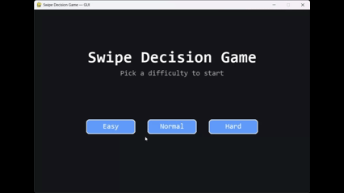

# Swipe Decision Game — GUI (Pygame)

A choice-driven survival game with a graphical interface powered by Pygame.  
The player faces daily scenarios, selects Left or Right choices, and tries to survive while managing HP, Food, and Morale.  
The GUI uses a separate engine module to keep core game logic independent from rendering.
Upgraded version of previous console project [Swipe-Decision-Game](https://github.com/mistforged/swipe-decision-game)

! Used ChatGPT for making GUI

## 🎥 Gameplay (GIF)



---

## 📦 Installation

1. Clone the repository:
```bash
git clone https://github.com/mistforged/SwipeDecisionGameGUI.git
cd SwipeDecisionGameGUI
```

2. Install dependencies:
```bash
pip install pygame
```

---

## ▶ Run the Game (GUI)

From the project root:
```bash
python -m gui_pygame.main
```

---

## 🧪 Smoke Test (CLI)

Run the minimal console runner:
```bash
python cli_runner.py
```

---

## 🎮 Controls

- Left → choose Left
- Right → choose Right
- Mouse → click the Left/Right buttons
- Mouse Wheel / ↑ / ↓ / PageUp / PageDown / Home / End → scroll event log
- Enter → confirm on Game Over screen

---

## 🧠 Game Rules

- **Stats**
  - HP: 0 results in defeat
  - Food: decreases daily; starvation reduces HP and morale over time
  - Morale: if too low for several days, results in defeat
- **Daily Flow**
  - Read scenario → choose Left or Right
  - Some choices have success/failure chance
  - Surprise events may occur
  - Daily decay applies
- **Objective**
  - Survive the full number of days for your difficulty
  - Score is calculated from days survived and remaining stats

---

## ⚙️ Difficulty and Engine

- Difficulty affects starting/max stats, surprise rate, and thresholds
- Engine files in `engine/`:
  - `config.py` – constants and difficulty tables
  - `player.py` – player stats and updates
  - `scenarios.py` – scenarios and events
  - `game.py` – game state functions

---

## 🧭 Project Structure

```
SwipeDecisionGameGUI/
├─ engine/
├─ gui_pygame/
├─ cli_runner.py
├─ README.md
└─ requirements.txt
```

---

## 📄 License

MIT License

---

## 👤 Author

- Vladimir Jerković — [GitHub Profile](https://github.com/mistforged)
